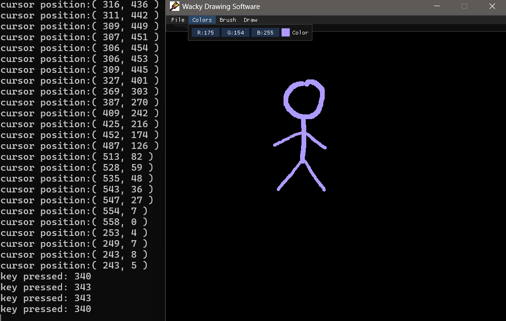

# Wacky Drawing Software

## Introduction

Welcome to **Wacky Drawing Software**, a project I've worked on for a month. This is my first venture into using C++ and OpenGL, and I'm excited to share it with you. This software serves as a testament to my learning journey, and I hope it inspires others.

## Goal

The primary goal of this project is self-learning. While I didn't initially intend to publish it for professional use, I'm making it available for anyone who might find it helpful or interesting. It's a great starting point for those looking to understand the basics of C++ and OpenGL.

## Permission

Feel free to use and modify this code as you wish. You don't need my permission to do so. Whether you're looking to learn, tinker, or build upon this project, you're welcome to explore and innovate.

## Libraries

The libraries used in this project are listed in the [Libraries folder](Libraries). These libraries are crucial for the functionality and performance of the software.
